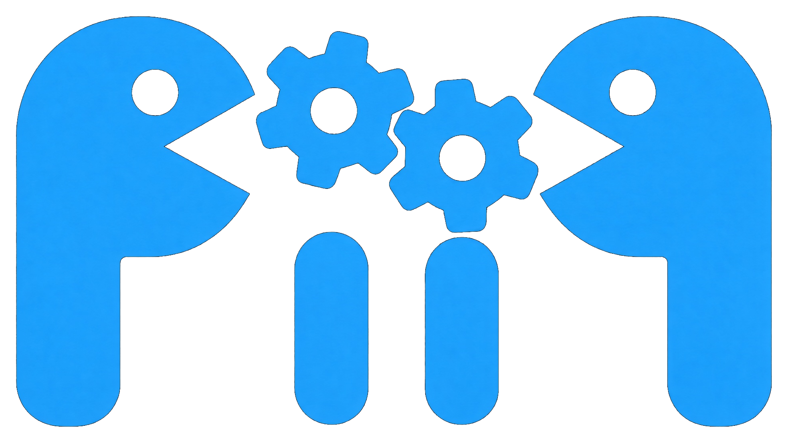

<p align="center">
  
</p>

# Process Information Infrastructure Protocol (PIIP)

YAML-based information model specification following an **Entity-Component-System (ECS)** architecture for infrastructure.

## Specification

| Document | Content |
|----------|---------|
| [Syntax](doc/syntax.md) | YAML syntax reference — all elements, member forms, naming conventions, versioning rules |
| [Architecture](doc/architecture.md) | ECS architecture, three-layer concern model (Domain / System / Process), Linked Data, generation targets |
| [Validation](doc/validation.md) | Validation pipeline (L1 yamllint, L2 JSON Schema, L3 semantic cross-file checks) |
| [Ontologies](doc/_generated_ontologies.md) | Auto-generated documentation for all ontology YAML files (files prefixed with `_` are generated) |

## Quick Start

Validate and generate documentation with the `piip` tools ([PIIP_tooling](https://github.com/A-S-Consult-GmbH/PIIP_tooling)):

```
pip install piip
piip validate --config piip_config.yaml
piip docs --config piip_config.yaml
```

Until PyPI:

```
pip install git+https://github.com/A-S-Consult-GmbH/PIIP_tooling.git@v0.1.0
```

A forkable consumer (own YAML plus public URIs, no spec checkout) is [PIIP_example](https://github.com/A-S-Consult-GmbH/PIIP_example). Tools are Apache 2.0 in the tooling repository.

Each ontology YAML file is named after its ontology and lives under `spec/` (optional subfolders). Structure:

```yaml
- Ontology:
    Name: <Name>
    Meta:
        Uri: https://w3id.org/piip/<Path>/1
        Organization: A+S Consult GmbH FuE
        OrganizationUri: https://apluss.de/a+s_consult
        Version: 1.0.0
    LinkedOntologies:           # dependencies to other ontologies
        - Core:
            Uri: https://w3id.org/piip/Core/1
    Enums:                      # optional — fixed value sets
    ValueTypes:                 # optional — composite value objects (no identity)
    Components:                 # atomic, disjoint data packets (*Component)
    Archetypes:                 # descriptive Component compositions (*Archetype)
```

Entity data is represented by a separate `InstanceSet` document. An `InstanceSet`
links the ontologies that define its Components and stores UUID-identified
Entities:

```yaml
- InstanceSet:
    Name: DemoInstanceSet
    LinkedOntologies:
        - Core:
            Uri: https://w3id.org/piip/Core/1
        - Demo:
            Uri: https://example.org/piip-example/Demo/1
            Prefix: demo
    Entities:
        - Id: 11111111-1111-1111-1111-111111111111
          Components:
            NameComponent:
                name: "Demo entity"
            demo:DemoMarkerComponent: {}
```

`InstanceSet` syntax is specified in [doc/syntax.md](doc/syntax.md), and the
same validation pipeline checks both ontology and instance documents.

See [doc/syntax.md](doc/syntax.md) for the full syntax reference.

## Permanent identifiers (w3id)

Stable ontology IRIs are published via [w3id.org/piip](https://w3id.org/piip) and redirect into this repository.

| Permanent IRI | Redirect target |
|---------------|-----------------|
| `https://w3id.org/piip` | this repository |
| `https://w3id.org/piip/{Path}/{Major}` | `spec/{Path}.yaml` on branch `main` |
| `https://w3id.org/piip/{Path}/{X.Y.Z}` | `spec/{Path}.yaml` at git tag `v{X.Y.Z}` |

`{Path}` is the path under `spec/` without the `.yaml` suffix. Subfolders are allowed and become IRI path segments.

| File in repo | Ontology IRI (major) | Snapshot IRI (optional) |
|--------------|----------------------|-------------------------|
| `spec/Core.yaml` | `https://w3id.org/piip/Core/1` | `https://w3id.org/piip/Core/1.0.0` |
| `spec/Rail/Signaling.yaml` | `https://w3id.org/piip/Rail/Signaling/1` | `https://w3id.org/piip/Rail/Signaling/1.0.0` |

Rules:

- **`Meta.Uri`** uses the **major** form only (`…/{Path}/1`). Keep this stable across minor/patch releases.
- **`Meta.Version`** holds full SemVer (`1.0.0`).
- **Snapshot** IRIs require a git tag named `vX.Y.Z` (GitHub UI: Releases → create tag `v1.0.0`, or `git tag -a v1.0.0 && git push origin v1.0.0`).
- Breaking change → new major path (`.../2`); keep `.../1` pointing at the last compatible tag if needed.
- New ontology: add `spec/{Path}.yaml` and set `Meta.Uri` to `https://w3id.org/piip/{Path}/1` — no w3id rule change.

# License
Copyright &copy; 2026 A+S Consult GmbH FuE

This specification is licensed under [CC BY-ND 4.0](https://creativecommons.org/licenses/by-nd/4.0/legalcode). See [LICENSE](LICENSE). Validation and documentation tools are a separate Apache 2.0 package: [PIIP_tooling](https://github.com/A-S-Consult-GmbH/PIIP_tooling).

The ECS architecture and ontology design are based on the doctoral thesis *"Ein komponentenbasiertes Rahmenwerk für Gleisnetze: Trassierung, Topologie und Fachobjekte in einer Entity-Component-System-Architektur"* by Jens Bartnitzek (BTU Cottbus–Senftenberg).

## Specification — CC BY-ND 4.0

The specification (ontology YAML files and documentation) is licensed under the Creative Commons Attribution-NoDerivatives 4.0 International Public License.
You can implement the specification in services, clients or processing tools without restrictions.

You may also extend or modify the standard using the built-in extension and profiling mechanisms, however modified or extended versions of the standard may not be redistributed. The standard may only be redistributed in its unmodified version, under the same license.

You are free to:

- Share — copy and redistribute the material in any medium or format for any purpose, even commercially.
- The licensor cannot revoke these freedoms as long as you follow the license terms.

Under the following terms:

- Attribution — You must give appropriate credit, provide a link to the license, and indicate if changes were made. You may do so in any reasonable manner, but not in any way that suggests the licensor endorses you or your use.
- No derivatives — If you remix, transform, or build upon the material, you may not distribute (see note below) the modified material.
- No additional restrictions — You may not apply legal terms or technological measures that legally restrict others from doing anything the license permits.
