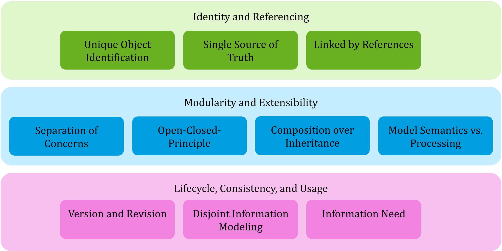
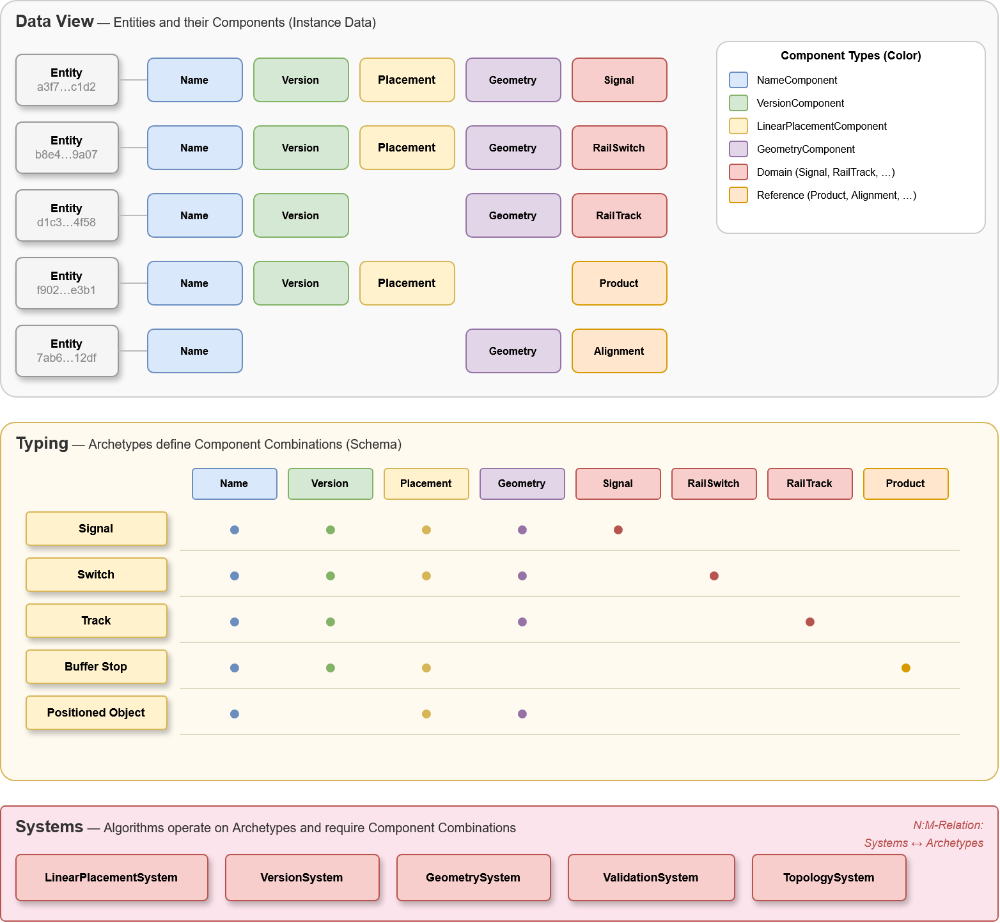
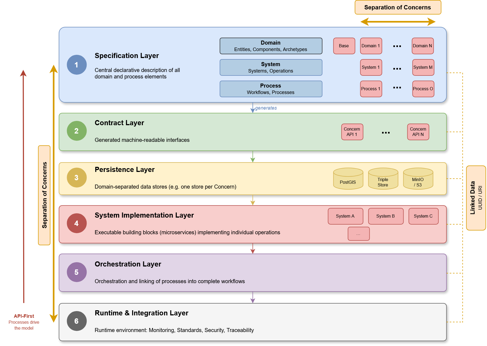
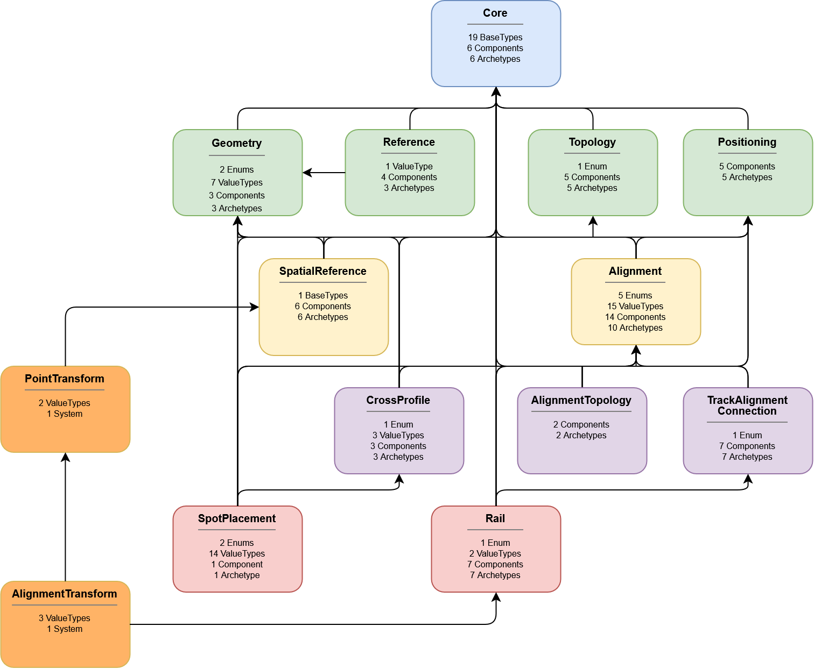

# PIIP Architecture

### Design Principles

- **Composition over inheritance**: Entities gain behaviour by attaching Components, not by subclassing.
- **Disjoint Components**: No Component may structurally depend on or inherit from another.
- **Open World Assumption (OWA)**: An Entity may possess more Components than any Archetype declares. Archetype membership is checked by Component presence, not by an exhaustive type tag.
- **Separation of Concerns**: Every piece of information is modelled in exactly one Component. Geometry, properties, topology — all are equal-rank Components.



## Entity-Component-System (ECS) Fundamentals

The PIIP follows an **Entity-Component-System** architecture:

| Concept     | Role                                                                                   |
|-------------|----------------------------------------------------------------------------------------|
| **Entity**  | Pure identity anchor (UUID) with no data of its own.                                   |
| **Component** | Disjoint, atomic data packet describing exactly one facet. No inheritance, no logic.  |
| **Archetype** | Descriptive composition of Components — a named "view" on an Entity.                 |
| **System**  | Stateless processing unit operating on Entities matching a Component/Archetype query.   |



## Three-Layer Specification

The Specification Layer organises all definitions into three orthogonal concerns. Each concern uses the same YAML ontology structure (Meta, LinkedOntologies, etc.) but adds concern-specific elements.



## Architectural Overview

The domain ontologies form a directed acyclic dependency graph and cover alignment design, topology, positioning, discretisation, cross-profile formation, and spatial reference with respect to the track network. The system ontologies *PointTransform* and *AlignmentTransform* specify interchangeable operation contracts for georeferencing.



### Domain Concern

Defines **what** exists: Entities, Components, Archetypes, ValueTypes, Enums, BaseTypes.

This is the core of the YAML syntax described in [syntax.md](syntax.md) and realised in the ontology YAML files.

### System Concern

Defines **how** data is processed. A System ontology links Domain ontologies and declares:

| Element     | Description                                                       |
|-------------|-------------------------------------------------------------------|
| **System**  | Named processing program containing Operations and Events.        |
| **Operation** | Atomic function with typed `Input` (Archetypes) and `Output` (Components/ValueTypes). |
| **Event**   | Typed message emitted after an Operation succeeds. Payload is a list of Members. |

Systems are algorithmically closed — a System does not know its consumers. Decoupling happens through Events consumed by the Process Concern.

```yaml
- Ontology:
    Name: PlacementCalculation
    Meta:
        Uri: https://w3id.org/piip/PlacementCalculation/1
    LinkedOntologies:
        - Core:  { Uri: https://w3id.org/piip/Core/1 }
        - Placement: { Uri: https://w3id.org/piip/Placement/1 }
    ValueTypes:
        - PlacementResult:
            Members:
                - Optional<AffineTransformation3D> coordinateSystem
                - Optional<String> errorMessage
    Systems:
        - PlacementCalculationSystem:
            Operations:
                - CalculatePlacement:
                    Input:
                        - { Name: placedEntity, Type: Link<PlacedArchetype> }
                    Output:
                        - { Name: result, Type: PlacementResult }
            Events:
                - PlacementCalculated:
                    Payload:
                        - { Name: entity, Type: Entity }
                        - { Name: result, Type: PlacementResult }
```

### Process Concern

> **TBA**: Process ontologies (Workflows, Triggers, Steps, Publish) are planned but not yet implemented in the schema, validation pipeline, or tooling.

Defines **when** and **in which order** Systems execute. A Process ontology links Domain + System ontologies and declares:

| Element      | Description                                                       |
|--------------|-------------------------------------------------------------------|
| **Workflow** | Named process with Trigger, Steps, and Publish.                   |
| **Trigger**  | `Manual` (typed input), `Event` (reacts to System Event), or `Schedule`. |
| **Step**     | References a System + Operation, with optional `Condition` and I/O mapping. |
| **Publish**  | Declares the workflow's output artefacts (Archetype-typed).       |

```yaml
- Ontology:
    Name: DeliverCatenaryMast
    Meta:
        Uri: https://w3id.org/piip/processes/DeliverCatenaryMast/1
    LinkedOntologies:
        - Core: { Uri: https://w3id.org/piip/Core/1 }
        - PlacementCalculation: { Uri: https://w3id.org/piip/PlacementCalculation/1 }
        - Validation: { Uri: https://w3id.org/piip/Validation/1 }
    Workflows:
        - DeliverCatenaryMast:
            Trigger:
                - Manual:
                    Input:
                        - { Name: mastEntity, Type: CatenaryMastArchetype }
            Steps:
                - CalculatePosition:
                    System: PlacementCalculationSystem
                    Operation: CalculatePlacement
                - Validate:
                    System: ValidationSystem
                    Operation: ValidateArchetype
                    Condition: CalculatePosition.success
                - Persist:
                    System: PersistenceSystem
                    Operation: Store
                    Condition: Validate.success
            Publish:
                - { Name: deliverable, Type: CatenaryMastArchetype }
                - { Name: revision,    Type: RevisionMilestoneArchetype }
```

## Linked Data & Modularity

- Every ontology has a globally unique, dereferenceable URI containing the major version.
- Dependencies are declared via `LinkedOntologies` with versionised URIs.
- Types from linked ontologies can be used unqualified (unique names) or qualified via `Prefix:TypeName`.
- The URI scheme follows [w3id.org](https://w3id.org/) persistent identifiers.

## Semantic Versioning

| Change   | Version bump | URI change | Example                              |
|----------|-------------|------------|---------------------------------------|
| Breaking | Major       | New URI    | Remove/rename Component → `2` → `3`  |
| Additive | Minor       | Same URI   | New Component/Archetype → `2.0` → `2.1` |
| Docs     | Patch       | Same URI   | Fix typo in Doc → `2.0.0` → `2.0.1` |

**Frozen Components rule**: Published Components are never extended. New data → new Component. Archetype `Includes` of new Components is a Minor change.

## Generation Targets

> **TBA**: Code generation is planned but not yet implemented.

From the YAML specification, the following representations could be generated:

| Target           | Purpose                                        |
|------------------|------------------------------------------------|
| **RDF/TTL**      | Ontology for Linked Data, semantic web         |
| **EXPRESS**      | IFC-compatible schema (ISO 10303-11)           |
| **XSD**          | XML Schema for data exchange                   |
| **SQL**          | Relational database schema (Component → table) |
| **OpenAPI**      | RESTful API definition                         |
| **Code**         | Type-safe classes in target language           |
